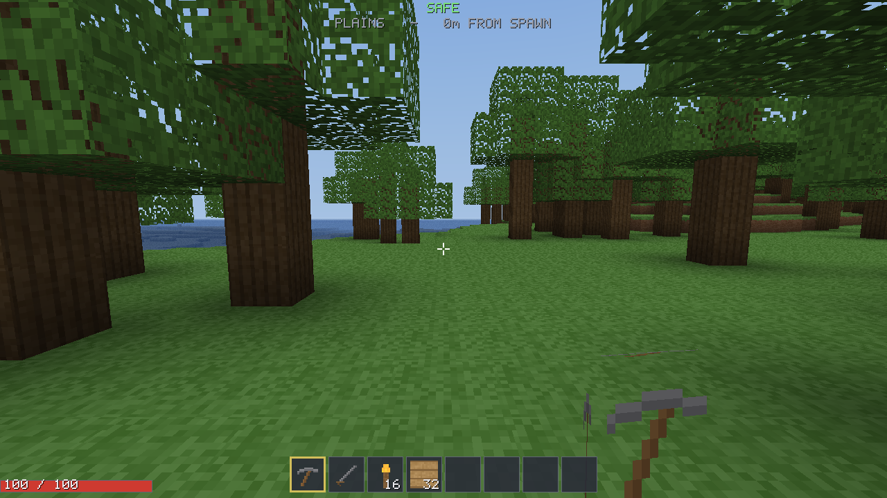
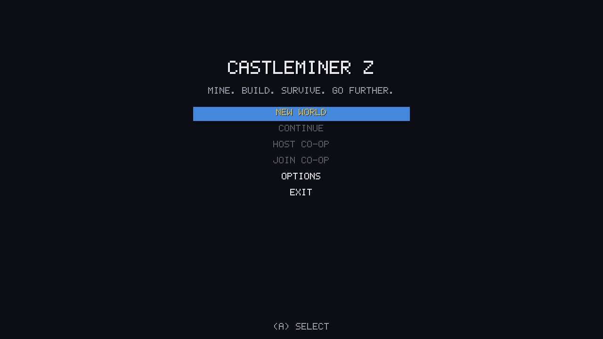
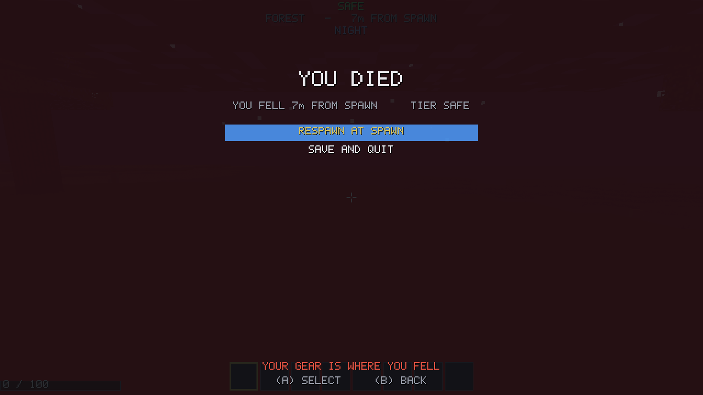

# CastleMiner Z

A voxel survival game for the **Xbox 360**, built on XNA Game Studio 4.0 — the same
stack the original Xbox Live Indie Games title shipped on.

Mine, build, and survive. The world is flat, endless, and gets worse the further you
walk from where you started. Everything that scales — which creatures spawn, how hard
they hit, which ores exist in the ground — reads from one number: your distance from
spawn. Diamond does not generate near the origin. Dragon stone does not generate until
six kilometres out, in the part of the map that is on fire and has dragons in it.
The only way to get better gear is to go somewhere that wants you dead.

---

## Running it

You need the **.NET 8 SDK** and nothing else. No XNA, no Visual Studio, no content build,
no shader compiler, no assets to download — every texture, sound and glyph in the game is
generated in code at startup.

```bash
cd castleminer-z
tools/run.sh
```

(or `dotnet run --project desktop/CastleMinerZ.Desktop.csproj` if you prefer)



### Controls on a keyboard

| Input | Action |
|---|---|
| `W` `A` `S` `D` | Move |
| Mouse | Look |
| Left click | Mine / attack / fire |
| Right click | Place block |
| `Space` / `Shift` / `Ctrl` | Jump / sprint / crouch |
| `1`–`8` or scroll | Hotbar |
| `R` / `F` | Reload / flashlight |
| `Tab` / `C` | Inventory / crafting |
| `Esc` | Pause |

A plugged-in controller works too, with the Xbox mapping below.

---

## The three builds

| Build | Runs on | Needs | For |
|---|---|---|---|
| `desktop/` | Windows, macOS, Linux | .NET 8 SDK | **Playing it.** This is the one above. |
| `CastleMinerZ.Xbox360` | Xbox 360 | Windows + VS2010 + XNA GS 4.0 + a dev console | The original target |
| `CastleMinerZ.Windows` | Windows | VS2010 + XNA GS 4.0 | XNA iteration without a console |

All three compile the same engine from `src/`. See [BUILD.md](BUILD.md).

The desktop build renders through the framework's built-in effects rather than the custom
`Voxel.fx`, because compiling a shader for MonoGame needs a tool that does not run
everywhere — and needing it would defeat the point of a build you can just launch. The
trade is small and specific: no flashlight cone, no water surface animation, and the
day/night cycle re-meshes as the sun moves instead of being free. Everything else — the
world, the lighting model, the gameplay — is identical, because it is the same code.

---

## What's in it

**World**
- Infinite streaming voxel terrain, 128 blocks tall, generated from a seed
- Simplex-noise continents, hills and ridged mountains, blended by a mountain mask
- Six biomes (plains, forest, desert, frozen wastes, mountains, scorched lands)
- Connected cave systems, ore veins, lakes, frozen seas, trees, surface lava
- Flood-filled sky and block lighting with smooth vertex lighting and ambient occlusion
- Full day/night cycle that costs zero re-meshing — sky light is scaled in the shader
- Water, glass and ice in a sorted transparent pass; leaves and torches alpha-tested

**Playing**
- First-person movement: walk, sprint, crouch, jump, swim, auto-step over low ledges
- Mine any block with the right tool tier; place any block you are carrying
- Fall damage, drowning, lava, and slow out-of-combat regeneration
- Handheld flashlight, because caves are genuinely dark

**Progression**
- 27 block types, 40+ items, 42 crafting recipes
- Four tool tiers (stone → iron → diamond → dragon), each gated on an ore that only
  generates past a certain distance
- Six firearms — pistol, shotgun, assault rifle, sniper, rocket launcher, laser rifle —
  with magazines, reloading, recoil, spread, and craftable ammunition
- Rockets that blow real craters in the terrain

**Danger**
- Zombies, runners, skeletons and hell spawn, spawning by darkness and by tier
- Sunlight burns the undead, so daytime is a genuine reprieve
- Dragons: a flying boss that circles, strafes, breathes fire, and drops the dragon
  stone you need for the best gear in the game
- Drop your inventory where you die (optional), which is what makes a long trip a real
  decision rather than a formality

**Console specifics**
- 1280x720, HiDef profile, no MSAA (see *Design notes* for why)
- Terrain generation and meshing on hardware threads 3 and 4, pinned
- Saves through the guide's storage device selector
- Title-safe HUD layout
- Controller-disconnect pause, as the platform requires
- Four-player Xbox LIVE co-op over `NetworkSession`, host authoritative

---

## Controls (Xbox 360)

| Input | Action |
|---|---|
| Left stick | Move |
| Right stick | Look |
| **A** | Jump |
| **B** | Crouch |
| **X** | Reload |
| **Y** | Inventory |
| **RT** | Mine / attack / fire |
| **LT** | Place block |
| **LB / RB** | Cycle hotbar |
| **L3** | Sprint |
| **R3** | Flashlight |
| **BACK** | Crafting |
| **START** | Pause |

The Windows build additionally accepts WASD, mouse look, `1`–`8`, `R`, `F`, `TAB`, `C`
and `Esc`.

---

## Design notes

A few decisions are worth calling out, because they are the ones the whole codebase
bends around.

**The vertex format is 12 bytes.** Terrain vertices pack a chunk-local position in
quarter-block units, an atlas tile index with a 0/1 corner selector, and baked light,
and the shader unpacks all of it. A naive position/normal/uv/colour layout would be
36 bytes; at a full view radius that difference is tens of megabytes on a console with
512 MB total, and the 360's vertex fetch is bandwidth bound, so the small format is
also the fast one.

**Every chunk shares one index buffer.** The quad index pattern is identical for all of
them. Giving each section its own would cost roughly 30 MB for no benefit.

**Light is baked per-vertex, night is applied in the shader.** Sky level and block level
are stored as separate 4-bit channels and scaled by a sun-intensity uniform at draw
time, so a full day/night cycle never touches a vertex buffer.

**Nothing allocates during play.** The Xbox 360 CLR runs a non-generational collector
roughly every megabyte allocated, which is a visible hitch. Voxel arrays, mesh scratch
buffers and mesh jobs all come from pools; particles, projectiles and dropped items are
fixed-capacity arrays; the random number generators are structs.

**Workers never read live world state.** Terrain generation is pure computation and runs
entirely on a worker thread. Meshing runs on a worker too, but from an 18³ snapshot the
main thread captured, so no worker can race a block edit or a column eviction. A version
counter per section catches the case where the world changed while a mesh was in flight.

**Player edits outlive their chunks.** The edit table is owned by the world, not by the
columns, keyed by column and packed local index. Build a base at the edge of your view
distance, walk away, and it is still there — and it is the only thing the save file
stores about terrain. Everything you did not touch is reproduced from the seed, which
is what keeps a heavily explored world down to a few hundred kilobytes.

**The game has almost no content.** Every texture, every sound effect and the font are
generated in code at startup, and the only asset the build pipeline touches is the shader.
That removes the whole class of problems where a content build fails on somebody else's
machine — no font that has to be installed to bake glyphs from, no atlas whose tile order
can drift out of step with the registries, no binaries of unclear origin in the repository.
It is also what lets the desktop build launch with nothing installed but the SDK.

**No MSAA.** The 360 has 10 MB of EDRAM, which holds a 720p colour and depth buffer
without tiling. Turning on multisampling forces predicated tiling, which means
submitting the entire scene twice. For a renderer whose cost is dominated by chunk draw
calls, that is the most expensive setting available.

---

## Repository layout

```
castleminer-z/
  CastleMinerZ.sln                 VS2010 solution (Xbox 360 + Windows + content)
  CastleMinerZ.Xbox360/            Xbox 360 game project — the shipping target
  CastleMinerZ.Windows/            Windows game project, same sources by link
  content/                         XNA content project -- one shader, nothing else
    CastleMinerZContent.contentproj
    Shaders/Voxel.fx               Terrain and water, vs_3_0 / ps_3_0
  src/                             The entire engine and game, shared by both projects
    Assets/                        Generated art, audio and font -- the whole content set
    Core/                          Constants, pooling, input, settings
    World/                         Chunks, generation, lighting, meshing, streaming
    Entities/                      Player, enemies, dragon, projectiles, drops
    Items/                         Items, inventory, crafting
    Graphics/                      Camera, terrain renderer, sky, entities, particles
    UI/                            Screen stack, HUD, menus, inventory and crafting
    Save/  Net/  Audio/            Persistence, LIVE co-op, sound
  tools/                           run.sh, screenshot.sh, check.sh
  desktop/                         MonoGame project -- the build you can actually run
  tests/                           Headless engine test suite
```

---


## Verification status

- **It runs.** Every screenshot in this README was captured by rendering the actual game
  headlessly, through `tools/screenshot.sh` (Xvfb plus software OpenGL). The game also has
  a `--dump-assets` switch that writes its generated art out as PNGs.
- **122 assertions pass** in `tests/`, headless: noise determinism, terrain
  well-formedness, distance-gated ore, lighting propagation and unwinding, mesh winding and
  packing bounds, raycasting, player collision and step-up, inventory and crafting
  arithmetic, edit persistence across chunk eviction, save/load round trips, a full session
  loop driven by synthetic input, and the code/content couplings that have no compile-time
  check.
- **Not run on an Xbox 360.** Building that configuration needs Windows, Visual Studio 2010
  and XNA Game Studio 4.0; deploying needs a dev-unlocked console. None of that exists in
  the environment this was written in, so `Voxel.fx`, the XNA content build and the
  on-console frame rate are unverified. The engine underneath them is the same code the
  desktop build runs.

Four bugs were found by actually running it, none of which the test suite could have
caught on its own:

- The **GPU upload step was never called**. Chunks generated, lit and meshed correctly and
  then sat in the completed queue forever, because uploading needs a graphics device and
  the headless tests have none. The world was invisible.
- **Terrain rendered inside-out.** The quads are wound counter-clockwise as seen from
  outside, which is the natural way to author and verify them — and is back-facing under
  the graphics default. You could see through the ground into the caves below. There is now
  a unit test that checks the winding of all six faces, and the index buffer reverses the
  triangles in one place with the reasoning written down.
- **Every glyph rendered as a solid white box.** The font's transparent texels were white
  with zero alpha, and the UI blends with premultiplied alpha, where the source colour is
  *added* — so "transparent" painted solid white.
- **A machine with no audio device crashed the game on startup**, which would have hit real
  players, not just headless capture.




The death screen above is not staged: night fell, zombies spawned and killed the player,
and the drop-on-death rule emptied the hotbar.
