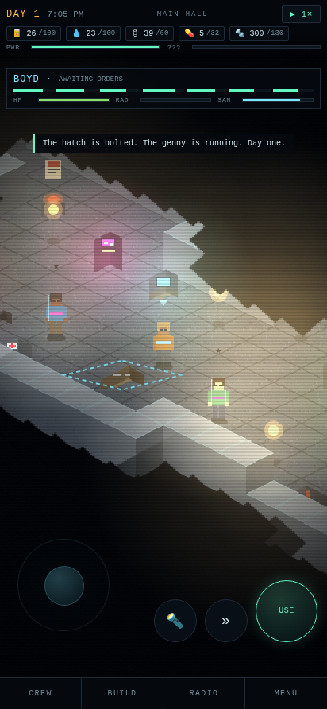
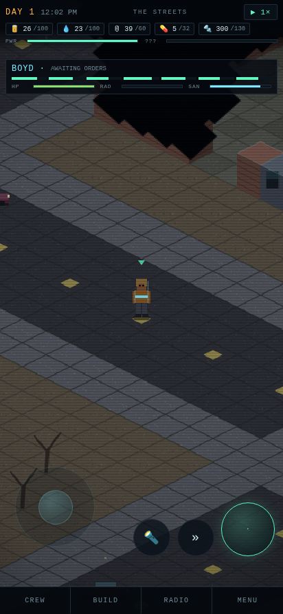
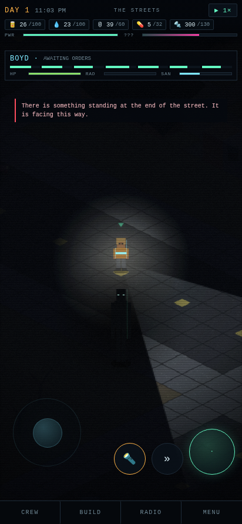

# BUNKER '86

An isometric survival sim set in the long dark after the bombs. October 1986,
Rad Springs, Nevada. You run a fallout shelter under a strip mall. Keep the
crew fed, watered, sane and out of the dark — and try not to attract attention
from whatever has started standing in the parking lot at night.

Sims-style needs and free will, Project Zomboid-style top-down exploration with
line of sight and looting, and the cold teal-and-magenta lighting of a
late-nineties dungeon crawler. Built to be played with two thumbs on an Android
phone.

| the shelter, powered | the streets at noon | something in the road |
|---|---|---|
|  |  |  |

---

## Play it on Android

The game is a PWA, so it installs from the browser — no Play Store, no APK, no
sideloading.

1. Host the `games/bunker-86/` folder over HTTPS (GitHub Pages, Netlify, Vercel,
   or any static host — see below).
2. Open the URL in Chrome on your phone.
3. Menu **⋮ → Add to Home screen** (Chrome usually offers an **Install** prompt
   on its own).

It then launches fullscreen from its own icon, runs offline, and keeps your
shelter in local storage.

### Hosting it on GitHub Pages

Push this repo, then in **Settings → Pages** serve from the branch root. The
game lands at:

```
https://<user>.github.io/<repo>/games/bunker-86/
```

### Running it locally

Needs a real HTTP server — service workers and `file://` do not mix.

```bash
cd games/bunker-86
python3 -m http.server 8099
# then open http://localhost:8099
```

### The single-file build

`dist/bunker-86.html` is the whole game inlined into one file. Open it directly
from disk, mail it to someone, put it on a USB stick. It has no service worker
or manifest, so it will not install to a home screen — it just runs.

```bash
node tools/build.mjs
```

---

## Controls

| | |
|---|---|
| **Left thumb** | Virtual stick. Touch anywhere in the lower-left to place it. |
| **Tap the world** | Walk there, or interact with whatever you tapped. |
| **Big round button** | Use the thing you are standing next to. The label tells you what. |
| **🔦 / »** | Flashlight, run. |
| **Pinch** | Zoom. |
| **CREW / BUILD / RADIO / MENU** | Crew management, buy mode, the log, settings. |

A keyboard works too, for desktop: `WASD`, `E` to interact, `F` for the torch,
`Shift` to run, `Space` to pause, `1`/`2`/`3` for game speed.

---

## How it plays

**The crew.** Everyone has seven needs, two traits from a pool of sixteen, six
skills that grow by doing, and opinions about each other that shift as they
share a room. On **FREE WILL** they look after themselves — eat, sleep, work,
argue. Take direct control of anyone from the CREW panel; the one you are
driving stops making their own decisions.

**The shelter.** Buy mode places furniture on the floor of the bunker for scrap.
The generator burns fuel and produces power; every powered object draws from it.
Overdraw and the shelter browns out, shutting things down in priority order —
lamps hold on longest. Dark rooms eat sanity, so light comes before luxuries.

**Topside.** Climb the ladder into a procedurally generated town: four blocks of
houses, shops, parking lots and craters, with containers to search and notes to
read. Your pack has limited slots; fill it, come home, and it goes into stores.
Radiation accumulates while you are out there, faster near the craters, and rads
permanently cap a survivor's maximum health until the med station brings them
down.

**The dark.** A hidden meter tracks how much attention the shelter has attracted.
Night, darkness, corpses and a frayed crew all raise it. Daylight, company, lamps
and a calm shelter bring it down. Past a threshold something starts turning up at
the edge of your vision — and it only moves when nobody is looking at it.

---

## Layout

```
games/bunker-86/
├── index.html              markup and HUD
├── css/style.css           the 1986 civil-defense terminal
├── js/
│   ├── util.js             seeded RNG, math, clock
│   ├── data.js             needs, furniture, traits, events, horror text
│   ├── world.js            tile maps: hand-built shelter, generated town
│   ├── art.js              every sprite, drawn procedurally at boot
│   ├── audio.js            WebAudio synth score, room tone, whispers
│   ├── render.js           iso camera, shadowcast LOS, light pools, CRT
│   ├── horror.js           dread, hallucinations, the watcher
│   ├── sim.js              time, needs, free will, power, looting, saves
│   ├── ui.js               panels, cards, toasts
│   └── main.js             boot, input, loop
├── tools/
│   ├── build.mjs           inline everything into dist/bunker-86.html
│   └── make-icons.py       generate PWA icons (no dependencies)
├── manifest.webmanifest
└── sw.js                   offline cache
```

No build step, no bundler, no dependencies, no network calls. Every sprite,
sound and tile is generated at runtime, which is why the whole thing is about
200 KB and works on a plane.

### Notes for anyone poking at it

- The town is generated from a seed (`BK.buildSurface(seed)`), so the same seed
  gives the same town. The shelter layout is hand-authored in `world.js`.
- Saves are a single localStorage key, `bunker86.save.v1`. Maps are regenerated
  from the seed on load and then have their mutations (looted containers, open
  doors, explored tiles, placed furniture) replayed over the top.
- Bump `CACHE` in `sw.js` when you ship changes or returning players will keep
  the cached build.
- `window.__ST` is the live game state in the console.

---

## Content note

Horror. Darkness, isolation, dead bodies described in text, characters who come
apart under pressure, and a stalking presence. No gore, no jump scares built on
loud noise alone.
