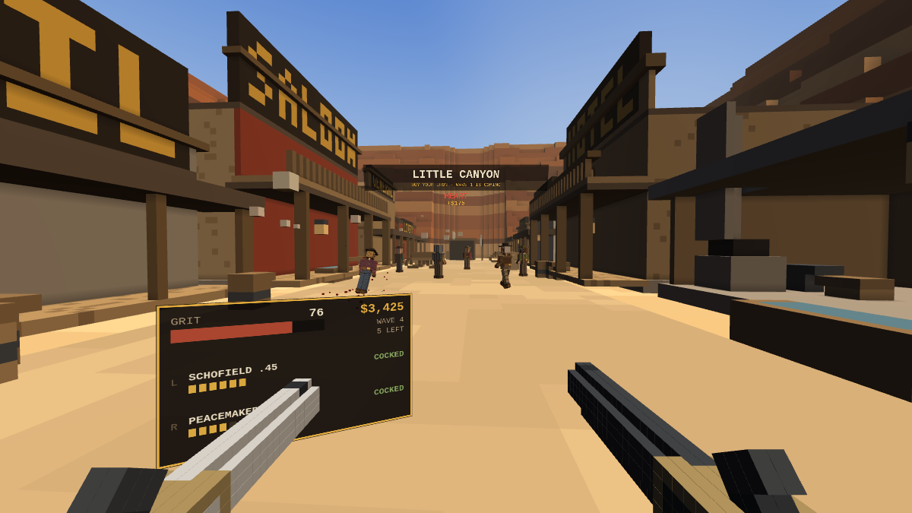

# LEAD & DUST — Last Stand at Little Canyon

A VR-only voxel western. One HTML file, no build step, no dependencies: WebGL2 and
WebXR, everything else — the town, the outlaws, the guns, the sound — is generated
at load time.



## The one rule

Every gun on the rack is a nineteenth-century gun, and a single-action revolver does
not fire because you pulled the trigger. It fires because you thumbed the hammer back
first.

- **Click the thumbstick** — the hammer comes back. The wrist plate reads `COCKED`.
- **Squeeze the trigger** — it goes off. Hammer down again.
- Pull the trigger on a dead hammer and all you get is a click, and whoever is walking
  at you gets a second and a half of your life.

A Colt Lightning is double action and skips the ritual, at the cost of being weak. A
Winchester wants the lever worked (same stick click). A coach gun wants both hammers
back for both barrels. A Gatling wants the crank turning and the trigger held at once.

## What a bullet actually does

An outlaw is not a hitbox with a health bar. He is about three thousand voxels in
layers — cloth, then meat, then bone, then what is underneath. A round spends a
**penetration** budget voxel by voxel as it tunnels:

| material | cost per voxel |
|---|---|
| cloth | 0.55 |
| flesh | 1.00 |
| leather | 1.30 |
| wood (walls, wagons, doors) | 2.30 |
| bone (skull, ribs, spine) | 2.70 |
| plate steel | 9.00 × the weapon's armour multiplier |

When the budget runs out the round stops where it is. If it stops against boiler plate
you get a spark and nothing else. If it has budget left when it comes out the other
side, it keeps going — into the man behind him, or through the saloon wall.

Two things end a man instantly, wherever the fight is:

- **The brain** — 3×3×3 voxels, behind a skull, behind skin, behind a hat.
- **The heart** — 2×2×2 voxels. Eight centimetres, low and slightly to his left,
  behind cloth, flesh, and a rib you might have to break first. The ribs have gaps
  between them; a round that threads one gets there cheaper.

Everything else is attrition. Voxels destroyed take structural damage off him, weighted
by where they were: the head counts for two and a half times, a limb for less than half.
Take enough off an arm and it comes off and he drops his gun. Take a leg and he crawls.
Take the head and the argument is over.

## Buying


Between waves a panel comes up in front of you — point at it and pull the trigger.
Kills pay, clearing a wave pays a bonus, and weapons carry a trade-in value if you want
to sell back into something bigger.

| weapon | year | pen | armour dmg | accuracy | recoil | cap | cost |
|---|---|---|---|---|---|---|---|
| Colt 1851 Navy (start) | 1851 | 6.2 | low | high | low | 6 | — |
| Volcanic Repeater | 1855 | 4.4 | low | fair | low | 8 | 600 |
| Colt Single Action Army | 1873 | 8.0 | med | high | med | 6 | 900 |
| S&W Schofield | 1875 | 7.2 | med | high | med | 6 | 1,250 |
| Coach Gun 12ga | 1878 | 5.2 × 9 | low | loose | brutal | 2 | 1,700 |
| LeMat (9 + buckshot barrel) | 1856 | 6.4 | med | fair | med | 9 | 1,950 |
| Colt 1877 Lightning (DA) | 1877 | 5.0 | low | fair | low | 6 | 2,200 |
| Winchester M1873 | 1873 | 13.0 | med+ | extreme | med | 12 | 2,600 |
| Sharps Big Fifty | 1874 | 34.0 | **high** | extreme | brutal | 1 | 3,800 |
| Gatling Gun | 1861 | 7.0 | med | fair | low | 100 | 7,200 |

Roughly what that buys you, centre of the chest: the Navy needs four or five, the
Peacemaker three or four, the Winchester three, a coach gun at conversational range
one. The Sharps takes a man down in one and goes on to punch through the plate on the
man behind him — armoured outlaws in boiler plate simply cannot be killed with pistols
from the front, which is the whole point of the armour-damage column.

Gear: **Duster Coat** (+40 armour) · **Boiler Plate** (+95) · **Speed Loaders** (45%
faster reloads) · **Fanning Glove** (slap the hammer with your free hand to cock and
fire in one motion, wild but fast) · **Vernier Sight** (35% tighter with long arms) ·
**Silver Spurs** (+20% foot speed) · **Snake Oil** (heal, right now).

## Controls

| | |
|---|---|
| left stick | walk |
| right stick | snap turn |
| **stick click** | **cock the hammer / work the lever / thumb both barrels** |
| trigger | fire, and click the buy panel |
| grip (hold) | reload — let go early and you lose it |
| A / X | open or recall the buy panel |
| B / Y | LeMat: swap between ball and the buckshot barrel |

Buy a long arm and it takes both hands; put your free hand on the forestock and the
group tightens by half and the recoil drops. Both hands can hold a pistol instead —
each with its own hammer to keep track of.

## Little Canyon

A town in the red rock at the south edge of **Tomlend**, a day's ride from **Dranden**
and two from the **Greef** line. Saloon, hotel, bank, jail, livery, blacksmith, church,
water tower, windmill, a mine at the north end and a gallows at the south. Outlaws ride
in through six gullies in the canyon wall; the porches, wagons, barrels and water
troughs are all cover, and most of them are wood, which means a big enough round will
come straight through.

Endless waves. Runners with knives, gunhands, riflemen who hang back, ironclads in
boiler plate and iron bucket helmets with an eye slit for a weak point, and a Marshal
every fifth wave. This build is the stand at Little Canyon; free roam of both states is
the next one.

## Running it

WebXR needs a secure context, so serve it rather than opening the file:

```bash
cd lead-and-dust
python3 -m http.server 8080
```

Then open `http://<your-machine>:8080/` in the headset browser (Quest Browser, Wolvic,
or desktop Chrome with a headset attached) and press **ENTER VR**. Headphones help —
the shots echo off the canyon wall.

There is a **flat preview** button on the menu for checking the build without a headset
(WASD, mouse look, click to fire, `F` to cock, `R` to reload, `B` for the store). It is
a development view, not the game.

## How it is put together

Single file, roughly 4,300 lines, no libraries.

- **Renderer** — WebGL2. The town is one face-culled voxel mesh with baked per-vertex
  ambient occlusion, split into chunks and frustum culled. Everything that moves
  (outlaws, guns, gore, smoke) is instanced unit cubes: one draw call per body part, so
  limbs can swing and come off. Past fifteen metres an outlaw switches to a merged
  half-resolution silhouette — one draw call instead of six.
- **World** — two voxel grids, 1 m for the canyon and ground, 0.25 m for the town, both
  painted procedurally from a seeded RNG and meshed at load (~0.2 s to generate,
  ~275k faces). Shopfront lettering is stamped into the voxels with a 3×5 pixel font.
- **Bodies** — 21×50×16 voxels at 4 cm, built per spawn with random skin, shirt, vest,
  hat, hair and duster, plus a parallel array marking which limb each voxel belongs to
  so severing knows what to take.
- **Ballistics** — 3D DDA (Amanatides & Woo) through the static world and then through
  each body's local grid, in distance order, spending the penetration budget per voxel
  and carving a wider channel for fat rounds.
- **Sound** — entirely synthesised WebAudio: filtered noise bursts for the report,
  a delayed pair for the canyon slap-back, positional panning per shot, and a wind bed.
