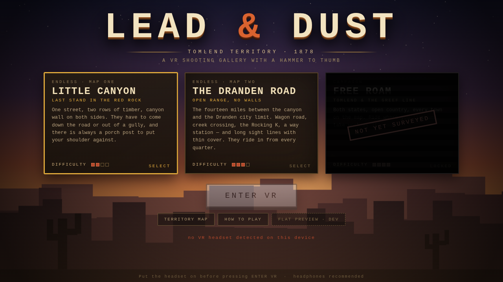
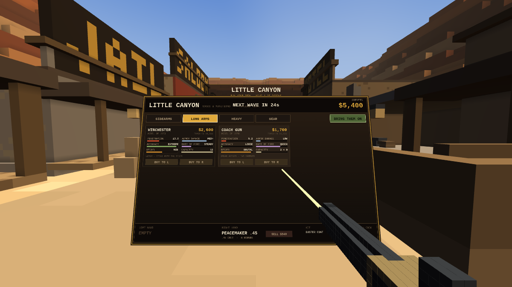
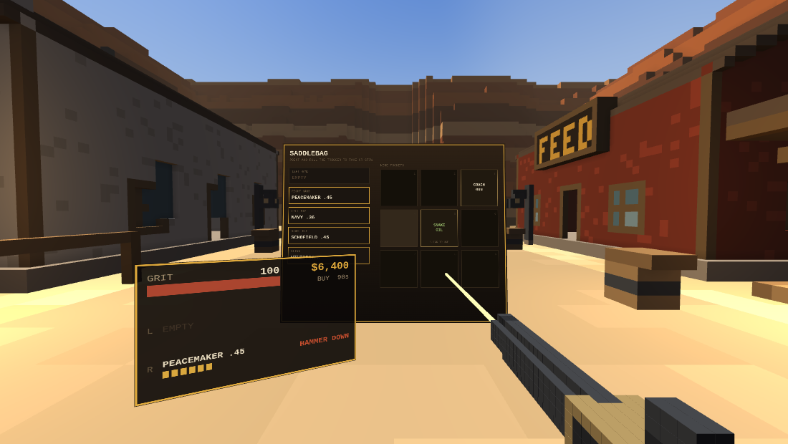
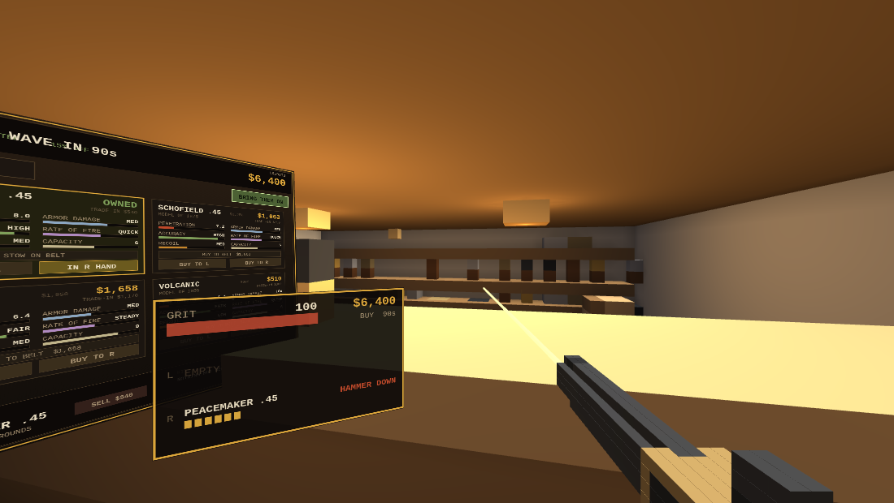
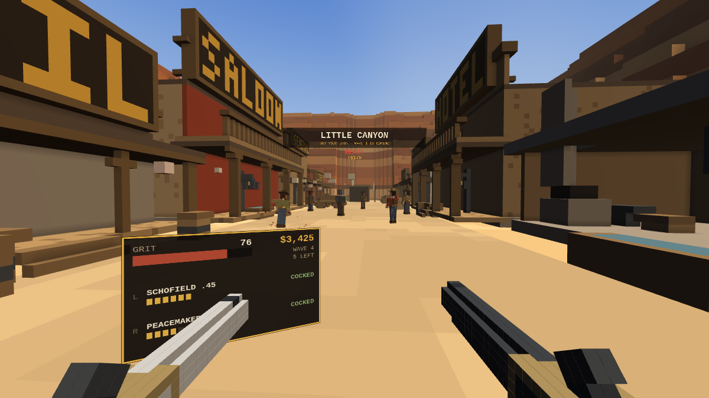
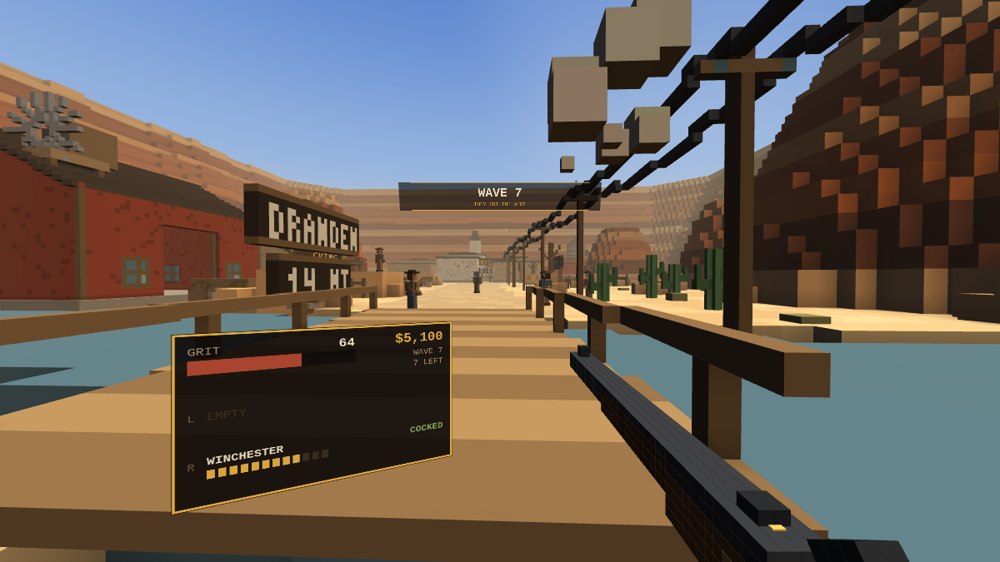
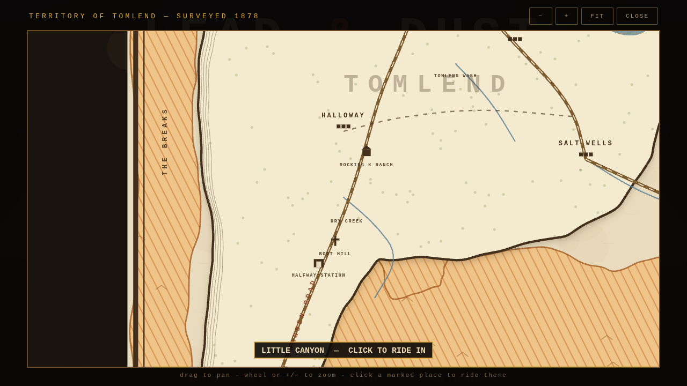

# LEAD & DUST — Tomlend Territory, 1878

A VR-only voxel western. One HTML file, no build step, no dependencies: WebGL2 and
WebXR, everything else — the town, the outlaws, the guns, the sound — is generated
at load time.



## The one rule

Every gun on the rack is a nineteenth-century gun, and a single-action revolver does
not fire because you pulled the trigger. It fires because you thumbed the hammer back
first.

- **Click the thumbstick** — the hammer comes back. The wrist plate reads `COCKED`.
- **Squeeze the trigger** — it goes off. Hammer down again.
- Pull the trigger on a dead hammer and all you get is a click, and whoever is walking
  at you gets a second and a half of your life.

A Colt Lightning is double action and skips the ritual, at the cost of being weak. A
Winchester wants the lever worked (same stick click). A coach gun wants both hammers
back for both barrels. A Gatling wants the crank turning and the trigger held at once.

## What a bullet actually does

An outlaw is not a hitbox with a health bar. He is about three thousand voxels in
layers — cloth, then meat, then bone, then what is underneath. A round spends a
**penetration** budget voxel by voxel as it tunnels:

| material | cost per voxel |
|---|---|
| cloth | 0.55 |
| flesh | 1.00 |
| leather | 1.30 |
| wood (walls, wagons, doors) | 2.30 |
| bone (skull, ribs, spine) | 2.70 |
| plate steel | 9.00 × the weapon's armour multiplier |

When the budget runs out the round stops where it is. If it stops against boiler plate
you get a spark and nothing else. If it has budget left when it comes out the other
side, it keeps going — into the man behind him, or through the saloon wall.

Two things end a man instantly, wherever the fight is:

- **The brain** — 3×3×3 voxels, behind a skull, behind skin, behind a hat.
- **The heart** — 2×2×2 voxels. Eight centimetres, low and slightly to his left,
  behind cloth, flesh, and a rib you might have to break first. The ribs have gaps
  between them; a round that threads one gets there cheaper.

Everything else is attrition. Voxels destroyed take structural damage off him, weighted
by where they were: the head counts for two and a half times, a limb for less than half.
Take enough off an arm and it comes off and he drops his gun. Take a leg and he crawls.
Take the head and the argument is over.

## Buying



Between waves a panel comes up in front of you — point at it and pull the trigger.
Kills pay, clearing a wave pays a bonus, and weapons carry a trade-in value if you want
to sell back into something bigger.

| weapon | year | pen | armour dmg | accuracy | recoil | cap | cost |
|---|---|---|---|---|---|---|---|
| Colt 1851 Navy (start) | 1851 | 6.2 | low | high | low | 6 | — |
| Volcanic Repeater | 1855 | 4.4 | low | fair | low | 8 | 600 |
| Colt Single Action Army | 1873 | 8.0 | med | high | med | 6 | 900 |
| S&W Schofield | 1875 | 7.2 | med | high | med | 6 | 1,250 |
| Coach Gun 12ga | 1878 | 5.2 × 9 | low | loose | brutal | 2 | 1,700 |
| LeMat (9 + buckshot barrel) | 1856 | 6.4 | med | fair | med | 9 | 1,950 |
| Colt 1877 Lightning (DA) | 1877 | 5.0 | low | fair | low | 6 | 2,200 |
| Winchester M1873 | 1873 | 13.0 | med+ | extreme | med | 12 | 2,600 |
| Sharps Big Fifty | 1874 | 34.0 | **high** | extreme | brutal | 1 | 3,800 |
| Gatling Gun | 1861 | 7.0 | med | fair | low | 100 | 7,200 |

Roughly what that buys you, centre of the chest: the Navy needs four or five, the
Peacemaker three or four, the Winchester three, a coach gun at conversational range
one. The Sharps takes a man down in one and goes on to punch through the plate on the
man behind him — armoured outlaws in boiler plate simply cannot be killed with pistols
from the front, which is the whole point of the armour-damage column.

Gear: **Duster Coat** (+40 armour) · **Boiler Plate** (+95) · **Speed Loaders** (45%
faster reloads) · **Fanning Glove** (slap the hammer with your free hand to cock and
fire in one motion, wild but fast) · **Vernier Sight** (35% tighter with long arms) ·
**Silver Spurs** (+20% foot speed) · **Snake Oil** (heal, right now).

## Controls

| | |
|---|---|
| left stick | walk |
| right stick | snap turn |
| **stick click** | **cock the hammer / work the lever / thumb both barrels** |
| trigger | fire, and click any panel |
| grip | at your hip: holster or draw · behind your shoulder: the saddlebag · otherwise: **reload** |
| X (left A) | jump |
| Y (left B) | open the saddlebag |
| A (right A) | the peddler's catalogue |
| B (right B) | LeMat: swap between ball and the buckshot barrel |

Reloading is a **tap** of the grip, not a hold — the gun loads itself while you keep
moving, and a second tap stops it.

Buy a long arm and it takes both hands; put your free hand on the forestock and the
group tightens by half and the recoil drops. Both hands can hold a pistol instead —
each with its own hammer to keep track of.

On the menu: pick a map, then **ENTER VR**. **FLAT PREVIEW · DEV** runs the same map in
a window for checking the build without a headset — a development view, not the game:

| | |
|---|---|
| WASD / mouse | move and look |
| space | jump |
| click | fire · F cock · R reload |
| I or Tab | inventory (the same saddlebag panel) |
| B | the catalogue |

## Carrying it



You have two hands, a belt and a bag.

- **Two hip holsters and a sling.** Reach down to your hip and squeeze the grip: if
  your hand is full the gun goes in, if it is empty the gun comes out. Pistols go on
  the hips, long arms across your back. Whatever is holstered is drawn on your belt, so
  you can see what you are carrying.
- **A saddlebag with nine pockets.** Reach over your shoulder and grip to open it — or
  do it with a gun in hand to drop that gun straight in. Point at a pocket and pull the
  trigger to take something out or put it in. The same panel shows both hands and all
  three holsters, so it doubles as the inventory screen.
- Buying a gun into a full hand pushes the old one onto your belt, or into the bag if
  the belt is full. Snake oil goes in a pocket and is drunk from there.

## Shops



Between waves you can walk into a shop instead of thumbing through the catalogue on
your wrist. Little Canyon has **McCready's Guns & Ammunition** and a **general store**;
the Dranden Road has the store at **Halfway Station** and the gun room at the
**Rocking K**. Step up to the counter and the goods appear over it — and everything on
the counter is **15% off** the catalogue price, because you came to him.

The gun shops carry sidearms, long arms and heavy iron. The general stores carry the
outfit — coats, plate, speed loaders, sights, spurs and snake oil — plus a few pistols.

## Where you fight

Two endless maps, picked from the main menu or by clicking a marked place on the map.

### Little Canyon — *rough*



A town in the red rock at the south edge of **Tomlend**. Saloon with a balcony, hotel,
bank, jail, livery, blacksmith, church with a steeple, water tower, windmill, a mine at
the north end and a gallows at the south, all with painted shopfront lettering stamped
into the voxels. Outlaws ride in through six gullies in the canyon wall; the porches,
wagons, barrels and troughs are cover, and most of it is wood, so a big enough round
comes straight through.

### The Dranden Road — *hard ride*



The fourteen miles between the canyon and the **Dranden** city limit, and everything in
between: the wagon road with its telegraph line, a creek crossing on a timber bridge,
the Rocking K ranch, a stagecoach way station, boot hill, mesas and boulder fields. You
can see Dranden at the north end — the mill, the depot, the church spire, a boxcar on
the spur — but the road is closed at the city limit and that is as far as you ride.

Open country means long sight lines and thin cover, so it is meaner on purpose: enemies
shoot ~20% tighter, hit ~14% harder, come in bigger waves, and there are ten gullies and
draws for them to appear from instead of six. You start with more credits to compensate.

**Free roam** of both states is on the menu, blacked out. That is the next build.

## The territory map



The menu carries a proper surveyed map you can pan and zoom. Zoom out for the two states,
the Iron Vein Range and the Greef River; come down and the ranches, way stations, washes
and buttes appear; come down further and the towns open into street plans with the
buildings named. Places you can actually play are ringed — click one to ride in.

## Running it

WebXR needs a secure context, so serve it rather than opening the file:

```bash
cd lead-and-dust
python3 -m http.server 8080
```

Then open `http://<your-machine>:8080/` in the headset browser (Quest Browser, Wolvic,
or desktop Chrome with a headset attached) and press **ENTER VR**. Headphones help —
the shots echo off the canyon wall.

## How it is put together

Single file, roughly 4,300 lines, no libraries.

- **Renderer** — WebGL2. The town is one face-culled voxel mesh with baked per-vertex
  ambient occlusion, split into chunks and frustum culled. Everything that moves
  (outlaws, guns, gore, smoke) is instanced unit cubes: one draw call per body part, so
  limbs can swing and come off. Past fifteen metres an outlaw switches to a merged
  half-resolution silhouette — one draw call instead of six.
- **World** — every map is two voxel grids, 1 m for terrain and 0.25 m for structures,
  painted procedurally from a seeded RNG and meshed at load (~0.2 s to generate,
  ~270-290k faces). Shopfront lettering is stamped into the voxels with a 3×5 pixel font.
  Maps are a registry entry — terrain builder, structure builder, spawn points, bounds
  and difficulty tuning — so switching one out disposes the old meshes and rebuilds.
- **The map screen** — canvas cartography over a pan/zoom transform, with detail gated on
  zoom level: wobbled state borders, hachured ranges, hatched canyon country, dashed
  wagon roads, and street plans for the towns. Labels are drawn in screen space so they
  stay the same size however far you come down.
- **Bodies** — 21×50×16 voxels at 4 cm, built per spawn with random skin, shirt, vest,
  hat, hair and duster, plus a parallel array marking which limb each voxel belongs to
  so severing knows what to take.
- **Ballistics** — 3D DDA (Amanatides & Woo) through the static world and then through
  each body's local grid, in distance order, spending the penetration budget per voxel
  and carving a wider channel for fat rounds.
- **Lighting** — one directional sun plus the four lamps nearest the eye, uploaded as
  uniforms each frame, so shop interiors and porches are actually lit rather than being
  caves.
- **Sound** — entirely synthesised WebAudio: filtered noise bursts for the report,
  a delayed pair for the canyon slap-back, positional panning per shot, and a wind bed.
